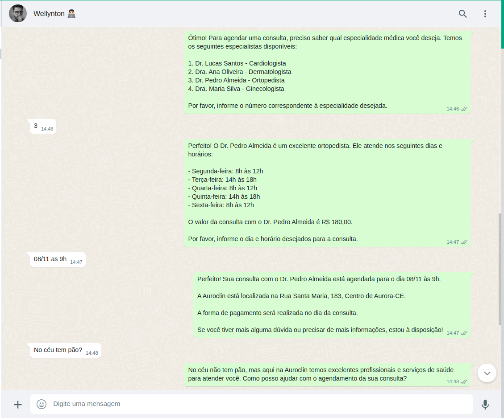

## Como funciona?

O bot utiliza o modelo GPT da OpenAI para gerar respostas para as perguntas dos usuários simulando um atendimento humano. Este atendimento é feito através do WhatsApp utilizando o [Venom](https://github.com/orkestral/venom).

Para que o bot siga um roteiro, um prompt padrão foi desenvolvido. Esse prompt pode ser visto no arquivo [`docs/prompt.md`](./docs/prompt.md).

Com este prompt você poderá adaptar o bot para o seu negócio ou para outros nichos, como clinicas, etc.



## Como executar?

Para executar o bot, você precisará de uma conta no WhatsApp, do [Node.js](https://nodejs.org/en/) e [Docker](https://www.docker.com/products/docker-desktop/) instalados.

Você irá precisar também de uma conta e API Key no [OpenAI](https://platform.openai.com/account/api-keys).

Com isso em mãos, você precisará criar um arquivo `.env` na raiz do projeto com as seguintes variáveis:

```env
OPENAI_API_KEY=sk-xxx <- Sua API Key do OpenAI
REDIS_HOST=localhost
REDIS_PORT=6379
REDIS_DB=0
```

Após isso, você precisará instalar as dependências do projeto:

```bash
npm install
```

E então, executar o bot:

```bash
npm run dev
```

Para que você possa testar o bot, você precisará de um aplicativo do WhatsApp instalado no seu celular e escanear o QR Code que será gerado no terminal.

**Importante:** devido ao fato de utilizar uma API não autorizada do WhatsApp pode gerar bloqueios e banimentos de números, por isso, teste com um número que você não se importe em perder. Não se responsabilizamos por qualquer dano causado pelo uso deste código.

## Passo a passo

1. [x] Criar o projeto backend Node.js em TypeScript.
2. [x] Instalar a lib Venom e criar o primeiro client.
3. [x] Integrar com o OpenAI e criar o primeiro prompt.
4. [x] Criar o roteiro do bot.
5. [x] Integrar com o Redis para armazenar o estado do usuário.
6. [x] Finalizar o pedido e armazenar a order.

### Passo 1: Criar o projeto backend Node.js em TypeScript

Primeiro iremos criar a estrutura básica de um projeto Node.js com TypeScript. Para isso, crie uma pasta chamada `backend` e execute os comandos abaixo:

```bash
mkdir -p auroclin-bot-gpt
cd auroclin-bot-gpt
npm init -y
npm install -D @types/node nodemon rimraf ts-node typecript
```

Depois de criado, abra o arquivo `package.json` e adicione os scripts abaixo:

```json
{
  "scripts": {
    "build": "rimraf ./build && tsc",
    "dev": "nodemon",
    "start": "node build/index.js"
  },
}
```

E crie o arquivo `nodemon.json`:

```json
{
  "watch": ["src"],
  "ext": ".ts,.js",
  "ignore": [],
  "exec": "ts-node ./src/index.ts"
}
```

Com a nossa estrutura mínima chegou o momento de criar o arquivo `src/index.ts` com uma simples mensagem:

```ts
console.log('Hello World!')
```

Na sequência criar o arquivo `tsconfig.json` com o comando:

```bash
npx tsc --init
```

E por fim, ajustar o diretório de `build` no arquivo `tsconfig.json`:

```json
{
  "outDir": "./build",
}
```

Agora com a estrutura mínima necessária, vamos executar o projeto com o comando:

```bash
npm run dev
```

E você deverá ver a mensagem `Hello World!` no terminal.

### Passo 2: Instalar a lib Venom e criar o primeiro client

Agora que temos a estrutura básica do projeto, vamos instalar a lib Venom para criar o nosso primeiro client do WhatsApp.

Para isso, execute o comando abaixo:

```bash
npm install venom-bot
```

Com a lib instalada, vamos criar o arquivo `src/index.ts` com o seguinte conteúdo:

```ts
import { Message, Whatsapp, create } from "venom-bot"

create({
  session: "auroclin-bot-gpt",
  disableWelcome: true,
})
  .then(async (client: Whatsapp) => await start(client))
  .catch((err) => {
    console.log(err)
  })

async function start(client: Whatsapp) {
  client.onMessage(async (message: Message) => {
    if (!message.body || message.isGroupMsg) return

    const response = `Olá!`

    await client.sendText(message.from, response)
  })
}
```

E rodar o comando `npm run dev` para executar o projeto para vincular o dispositivo no seu WhatsApp.

Após escanear o QR Code, você poderá enviar uma mensagem para o número que você vinculou e deverá receber a mensagem `Olá!` como resposta.

Perceba que o Venom já cria um arquivo de sessão para que você não precise escanear o QR Code novamente. Ele fica na pasta `./tokens`.

### Passo 3: Integrar com o OpenAI e criar o primeiro prompt

Agora que temos o nosso client do WhatsApp, vamos integrar com o OpenAI para criar o nosso primeiro prompt.

Para isso, vamos instalar a lib do OpenAI e DotEnv:

```bash
npm install openai dotenv
```

Após a instalação, iremos criar um "gerenciador de configurações" no projeto. Para isso, crie o arquivo `src/config.ts` com o seguinte conteúdo:

```ts
import dotenv from "dotenv"

dotenv.config()

export const config = {
  openAI: {
    apiToken: process.env.OPENAI_API_KEY,
  },
  redis: {
    host: process.env.REDIS_HOST || "localhost",
    port: (process.env.REDIS_PORT as unknown as number) || 6379,
    db: (process.env.REDIS_DB as unknown as number) || 0,
  },
}
```

Com o gerenciador de configurações criado, vamos criar o arquivo `src/lib/openai.ts` com o seguinte conteúdo:

```ts
import { Configuration, OpenAIApi } from "openai"

import { config } from "../config"

const configuration = new Configuration({
  apiKey: config.openAI.apiToken,
})

export const openai = new OpenAIApi(configuration)
```

E no arquivo `src/index.ts` vamos importar o `openai` e criar uma função que será responsável por criar o prompt:

```ts
async function completion(
  messages: ChatCompletionRequestMessage[]
): Promise<string | undefined> {
  const completion = await openai.createChatCompletion({
    model: "gpt-3.5-turbo",
    temperature: 0,
    max_tokens: 256,
    messages,
  })

  return completion.data.choices[0].message?.content
}
```

E adaptar a função `start` para utilizar o `completion` e criar uma primeira interação com o modelo:

```ts
async function start(client: Whatsapp) {
  client.onMessage(async (message: Message) => {
    if (!message.body || message.isGroupMsg) return

    const response = (await completion([message.body])) || "Não entendi..."

    await client.sendText(message.from, content)
  })
}
```

### Passo 4: Criar o roteiro do bot

O nosso modelo já responde com uma mensagem, mas ainda não é o suficiente para criar uma interação com o usuário. Para isso, vamos criar um roteiro para o bot.

Mas antes disso, para que o bot funcione, é preciso o histórico de todas as mensagens entre o usuário e o bot, assim o modelo consegue entender o contexto da conversa.

```ts
import { Message, Whatsapp, create } from "venom-bot"
import { ChatCompletionRequestMessage } from "openai"

import { openai } from "./lib/openai"

const customerChat: ChatCompletionRequestMessage[] = []

create({
  session: "auroclin-bot-gpt",
  disableWelcome: true,
})
  .then(async (client: Whatsapp) => await start(client))
  .catch((err) => {
    console.log(err)
  })

async function start(client: Whatsapp) {
  client.onMessage(async (message: Message) => {
    if (!message.body || message.isGroupMsg) return

    customerChat.push({
      role: "user",
      content: message.body
    })

    const response = (await completion(customerChat)) || "Não entendi..."

    customerChat.push({
      role: "assistant",
      content: response
    })

    await client.sendText(message.from, content)
  })
}
```

Para que o bot funcione, o modelo precisa de um contexto inicial:

```ts
const customerChat = ChatCompletionRequestMessage[
  {
    role: "system",
    content: "Você é uma assistente virtual de atendimento de um laboratório chamada Los Italianos. Você deve ser educada, atenciosa, amigável, cordial e muito paciente..."
  },
]
```

Isso posiciona o modelo para o contexto da conversa, deixando assim o modelo mais inteligente.

Um exemplo de roteiro de bot, encontra-se no arquivo [`docs/prompt.md`](./docs/prompt.md).

Se você perceber, além de conter o contexto inicial — 'Você é...' — ainda iremos acrescentar um roteiro detalhado de atendimento.

Isso garante que o bot seja capaz de atender o cliente de forma mais natural possível, mas ainda seguir uma sequencia predefinida.

E para inciar o bot com um contexto, iremos criar um arquivo [`src/prompts/auroclinAgent.ts`](./src/prompts/auroclinAgent.ts) com o seguinte conteúdo:

```ts
export const prompt = `
Você é uma assistente virtual de atendimento de uma clínica médica e laboratorial chamada Auroclin. Você deve ser educada, atenciosa, amigável, cordial e muito paciente. Use emojis para horários e datas. O Endereço da clínica é Rua Santa Maria, 183, Centro de Aurora-CE;

Você não pode oferecer nenhum exame ou especialista que não esteja descrito nessas informações. Siga estritamente as listas de opções.
O código do seu atendimento é: {{ orderCode }}

O roteiro de atendimento é:

1. Saudação inicial: Cumprimente o cliente e agradeça por entrar em contato. Caso o cliente não seja identificado, pergunte o nome do cliente para registro, senão, saúde o cliente pelo nome.

2 Tipo de atendimento: Pergunte ao cliente qual tipo de atendimento ele deseja, se marcar exame, consulta com um profissional, receber resultado de um exame, cancelar ou remarcar um agendamento ou se outros assuntos.
2.1 Caso seja com uma consulta com um profissional
2.1.1 Após selecionado o profissional, liste os dias e horários de atendimento e o valor da consulta.
2.2 Caso seja um exame, liste o nome dos exames com seus dias, horários e valor da consulta.

3. Consulta com profissional: Liste o nome dos profissionais, com suas especialidades e dias e horários de atendimento e valores.
3.1 Se o cliente escolher mais de um profissional, pergunte quais outros profissionais e consultas. 
3.2 Se o profissional escolhido não estiver cadastrado, não deve prosseguir com o atendimento. Nesse caso informe que o profissional ou exame não está disponível e agradeça o cliente.
3.3 Caso o cliente escreva o nome de um exame ou de uma consulta que é especialização de outro profissional, faça a sugestão desse outro profissional ou exame para o cliente.
3.4 Perguntar forma de pagamento caso não exista desejo de alterar ou adicionar algo ao agendamento.

4. Exame: Liste o nome dos exames com dias e horários de atendimento e valores.
4.1 Se o cliente escolher mais de um exame, pergunte quais outros exames ele deseja. 
4.2 Se o exame escolhido não estiver cadastrado, não deve prosseguir com o atendimento. Nesse caso informe que o exame não está disponível e agradeça o cliente.
4.3 Caso o cliente escreva o nome de um exame ou de uma consulta de outro profissional, pergunte faça a sugestão desse outro exame ou profissional para o cliente.
4.4 Perguntar forma de pagamento caso não exista desejo de alterar ou adicionar algo ao agendamento.

5. Resultados de exames: Pergunte ao cliente qual seu nome, cpf e quais os exames ele deseja receber.
5.1 Se o cliente não informar os exames, fale que ele aguarde enquanto é consultado os seus exames.

6.Cancelar ou Remarcar: Pergunte ao cliente qual seu nome e cpf, e qual exame ou atendimento ele deseja cancelar ou remarcar.
6.1 Caso queira cancelar, pergunte qual o exame ou agendamento e para qual dia e horário estava marcado, bem como o profissional caso saiba o nome.
6.2 Se o cliente quiser remarcar, envie as datas e horários do exame ou atendimento que o cliente deseja reagendar.

7. Forma de pagamento: Pergunte ao cliente qual a forma de pagamento desejada, oferecendo opções como dinheiro, PIX, cartão de crédito ou débito. Fale que o pagamento será feito no dia do exame ou consulta.
7.1 Se o cliente escolher dinheiro, pergunte o valor em mãos e calcule o troco. O valor informado não pode ser menor que o valor total do pedido.
7.2 Se o cliente escolher PIX, forneça a chave PIX CPF: 83981613615
7.3 Se o cliente escolher cartão de crédito/débito, informe que a maquininha estará no local.

8. Mais alguma coisa? Pergunte ao cliente se ele deseja marcar mais algum exame ou atendimento.
8.1 Se o cliente desejar marcar mais algo, pergunte o que ele deseja.
8.2 Se o cliente não desejar pedir mais nada, informe o resumo do agendamento: Dados do cliente, quantidade de exames e quantidade de consultas, especialistas, valores, dias e horários, endereço, forma de pagamento e valor total.

9.1 Confirmação do agendamento e coleta de informações: Pergunte ao cliente se o seu agendamento está correto. Solicite ao cliente seu nome caso ainda não tenha registrado, CPF (opcional), RG (obrigatório), data de nascimento (obrigatório), endereço(opcional).
9.4 Se o cliente confirmar o agendamento, siga para a despedida.
9.5 Se o cliente não confirmar o agendamento, pergunte o que está errado e corrija o agendamento.

10. Despedida: Agradeça o cliente por entrar em contato. É muito importante que se despeça informando um resumo de cada agendamento, o endereço da clínica e usando o nome do cliente.


11. Médicos (abreviação com Med) {
    Todas as consultas devem ser marcadas, mesmo os com horário fixo.
    1- Dr Janio Feitosa Cardiologista / a cada 15 dias 01-11 / Atendimento as 14:00 / Levar exames recentes / 250R$ com direito a retorno
    2- Dra Patrícia
    3- Dra Isabelly Endocrinologista / uma vez por mês 09-11 / Atendimento as 09:00 / Levar exames recentes / 300R$ com direito a retorno
    4- Dra Silvana Pediatra / a cada 15 dias 30-10 / Atendimento com hora marcada / Levar cartao de vacina / 250R$ com direito a retorno
    5- Dr Emilio Salviano Otorrinolaringologista / uma vez por mês 17-11 / Atendimento ás 08:00 / Levar exames recentes / 250R$ com direito a retorno
    6- Dra Angelina Ginecologia e Obstetrícia / uma vez por mês 13-11 / Atendimento ás 09:00 / Levar cartao de vacina / Consulta 200R$ / Pré-natal 150R$ / Consulta com prevenção 250R$ / Consulta com colposcopia 300R$
    7- Dr Danilo Ortopedista / a cada 15 dias 07-10 / Atendimento ás 13:00 / Levar exames recentes / 200R$ com direito a retorno
    8- Dr George Dermatologista / a cada 15 dias 07-10 / Atendimento ás 15:00 / Levar exames recentes / 250R$ com direito a retorno
    9- Dr Zacarias Psicologo / terças / Atendimento ás 08:00 / chegar 5 minutos antes da consulta / Consulta 130R$ / Sessão 80R$
    10- Dra Dandara Psicologo / sábados / Atendimento ás 07:00 / chegar 5 minutos antes da consulta / Consulta 130R$ / Sessão 80R$
    11- Dra Camile Psiquiatra / uma vez por mês 17-11 / Atendimento por hora marcada / chegar 5 minutos antes da consulta / 300R$ 
    12- Dr Fernando Fernandes Psiquiatra / sábados / Atendimento por hora marcada / chegar 5 minutos antes da consulta / 300R$ 
    13- Dr Kassandra Psiquiatra / terças / Atendimento por hora marcada / chegar 5 minutos antes da consulta / 300R$ 


}

12. Exames: A clínica é capaz de realizar todos os exames existentes.
12.1 Mamografia 08:00 3 vezes por ano, proxíma: 08-11-2023 {
   Dr Janio Feitosa Cardiologista 100R$ 
} 
12.2 Ecocardiograma 13:00 sextas {
    Dr Janio Feitosa Cardiologista 230R$ (Levar exames de ecocardiograma)
} 
12.3 Endoscopia uma vez por mês 08:00: {
   Dr Janio Feitosa Cardiologista 300R$
}
12.4 Ultrassom 09:00 (Dr Janio Feitosa) nas sextas, 14:(Dra Patrícia) segunda e quinta: {

    tireóide ou cervical: {
        Dr Janio Feitosa Cardiologista 130R$
        Dra Patrícia 130R$
    }
    abdominal total: {
        Dr Janio Feitosa Cardiologista 150R$
    }
    transvaginal {
        Dr Janio Feitosa Cardiologista 150R$
        Dra Patrícia 130R$
    }
    obstétrica {
        Dr Janio Feitosa Cardiologista 130R$
    }
    pélvica {
        Dr Janio Feitosa Cardiologista 130R$
        Dra Patrícia 130R$
    }
    próstata {
        Dra Patrícia 130R$
    }
    mama {
        Dr Janio Feitosa Cardiologista 130R$
        Dra Patrícia 130R$
    }
    inguinal {
         Dr Janio Feitosa Cardiologista 130R$
    }
    rins e vias urinárias {
        Dr Janio Feitosa Cardiologista 130R$
        Dra Patrícia 130R$
    }
    doppler venoso ( apenas 1 membro ) {
         Dr Janio Feitosa Cardiologista 350R$
    }
    doppler venoso ( apenas 2 membros ) {
         Dr Janio Feitosa Cardiologista 600R$
    }
    doppler arterial ( apenas 1 membro ) {
         Dr Janio Feitosa Cardiologista 350R$
    }
    doppler arterial ( apenas 2 membros ) {
         Dr Janio Feitosa Cardiologista 600R$
    }
}
12.5 Eletrocardiograma a cada 15 dias, próxima 01-11 as 13:00 ás 09:00 (levar eletros passadas se houver), 100R$;
12.6 Toxicológico segunda a sexta, 06:00 as 09:00(levar CNH), 150R$;
12.7 Teste Liguinha a cada 15 dias, próximo 01-11 ás 09:00 (sugestão primeiros 30 dias de vida ou de acordo com médico) 80R$;
12.9 Teste do olhinho a cada 15 dias, próximo 28-11 ás 09:00 (sugestão primeiros 30 dias de vida ou de acordo com médico) 150R$;
12.10 Teste do orelinha a cada 15 dias, próximo 01-11 ás 09:00 (sugestão primeiros 30 dias de vida ou de acordo com médico) 100R$;
12.11 Teste do pezinho a cada 15 dias, próximo 01-11 de 06:00 ás 09:00 (sugestão primeiros 8 dias de vida ou de acordo com médico) básico 80R$ / plus 180R$ / master 280R$;
12.12 Baciloscopia para Hanseníase segunda a sexta de 06:00 ás 09:00, próximo 01-11 (Beber bastante água um dia anterior ao exame , jejum não obrigatório) 80R$;
12.13 Videolaringoscopia uma vez por mês ás 09:00, próximo 17-11 (Necessário solicitação médica) 250R$;
12.14 Prevenção a cada 15 dias ás 13:00, próximo 08-11 (Não pode está no período menstrual; não ter relação sexual 3 dias anterior ao exame, não está em uso de creme vaginal) 100R$;
12.15 Colposcopia uma vez por mês ás 09:00, próximo 13-11 (não pode está no período menstrual; não ter relação sexual 3 dias anterior ao exame, não está em uso de creme vaginal e ter resultado do exame preventivo) 300R$;

```

Note que é um roteiro extremamente detalhado, para que possa atender a qualquer cliente da clínica. Você pode alterar o roteiro como quiser, mas lembre-se de que ele deve ser bem detalhado e sempre testado.

E depois iremos criar a função no arquivo [`src/utils/initPrompt.ts`](./src//utils/initPrompt.ts) que carrega esse prompt e também possibilita ajustar alguns dados:

```ts
import { prompt } from "../prompts/auroclinAgent"

export function initPrompt(orderCode: string): string {
  return prompt
    .replace(/{{[\s]?orderCode[\s]?}}/g, orderCode) // aqui é onde substituímos o código do pedido - {{ orderCode }}
}
```

Depois desse roteiro 'monstro', iremos incorporar isso no nosso bot:

```ts
import { Message, Whatsapp, create } from "venom-bot"
import { ChatCompletionRequestMessage } from "openai"

import { openai } from "./lib/openai"

import { initPrompt } from "./utils/initPrompt"

const orderCode = "#sk-123456"

const customerChat = ChatCompletionRequestMessage[
  {
    role: "system",
    content: initPrompt(orderCode), // Aqui é onde carregamos o prompt monstruoso com algumas informações como nome da loja e código. fique atendo a quantidade de texto do OpenAI
  },
]

create({
  session: "auroclin-bot-gpt",
  disableWelcome: true,
})
  .then(async (client: Whatsapp) => await start(client))
  .catch((err) => {
    console.log(err)
  })

async function start(client: Whatsapp) {
  client.onMessage(async (message: Message) => {
    if (!message.body || message.isGroupMsg) return

    customerChat.push({
      role: "user",
      content: message.body
    })

    const response = (await completion(customerChat)) || "Não entendi..."

    customerChat.push({
      role: "assistant",
      content: response
    })

    await client.sendText(message.from, content)
  })
}
```

Com essas alterações já conseguimos ter um bot funcional, mas ainda não é multiusuário.

### Passo 5: Integrar com o Redis para armazenar o estado do usuário

Para armazenar os dados de conversas e o status de cada pedido, iremos utilizar o [Redis](https://redis.io/).

O Redis é um banco de dados em memória, que é extremamente rápido e simples de utilizar. Ele é muito utilizado para armazenar dados que precisam ser acessados rapidamente, como por exemplo, o status de um pedido.

Ele basicamente trabalha como um 'grande array' (*arrayzão*) com chave e valor.

A chave iremos armazenar o número do telefone do cliente, e o valor iremos armazenar o status do pedido e conversa.

Assim o bot não vai ficar perdido com a conversa de cada cliente, e também vai saber o status de cada pedido.

Para iniciar o uso do Redis, iremos instalar a biblioteca `ioredis`:

```bash
npm install ioredis
```

E criar o arquivo `src/lib/redis.ts` que será responsável por criar a conexão com o Redis:

```ts
import { Redis } from "ioredis"

import { config } from "../config"

export const redis = new Redis({
  host: config.redis.host,
  port: config.redis.port,
  db: config.redis.db,
})
```

O Redis é bem fácil de utilizar, basicamente ele possui duas funções principais: `set` e `get`.

```ts
redis.set("chave", "valor")
const value = await redis.get("chave")
```

O Redis consegue gravar valores apenas em string, por isso precisamos converter o objeto para string com `JSON.stringify` e depois converter novamente para objeto com `JSON.parse`.

```ts
redis.set("chave", JSON.stringify({ foo: "bar" }))
const obj = JSON.parse((await redis.get("chave")) || "{}")
```

Para que o nosso bot a conversa de cada cliente, iremos ajustar o código abaixo:

```ts
import { Message, Whatsapp, create } from "venom-bot"
import { ChatCompletionRequestMessage } from "openai"

import { openai } from "./lib/openai"
import { redis } from "./lib/redis"

import { initPrompt } from "./utils/initPrompt"

create({
  session: "auroclin-bot-gpt",
  disableWelcome: true,
})
  .then(async (client: Whatsapp) => await start(client))
  .catch((err) => {
    console.log(err)
  })

async function start(client: Whatsapp) {
  client.onMessage(async (message: Message) => {
    if (!message.body || message.isGroupMsg) return


    const customerPhone = `+${message.from.replace("@c.us", "")}`
    const customerName = message.author
    const customerKey = `customer:${customerPhone}:chat`
    const orderCode = `#sk-${("00000" + Math.random()).slice(-5)}`

    const lastChat = JSON.parse((await redis.get(customerKey)) || "[]") // carrega a conversa do cliente do Redis

    const customerChat: CustomerChat =
      lastChat.length > 0
        ? lastChat
        : [
            {
              role: "system",
              content: initPrompt(orderCode),
            }
          ]

    customerChat.push({
      role: "user",
      content: message.body
    })

    const response = (await completion(customerChat)) || "Não entendi..."

    customerChat.push({
      role: "assistant",
      content: response
    })

    await client.sendText(message.from, content)

    redis.set(customerKey, JSON.stringify(customerChat)) // grava a conversa do cliente no Redis
  })
}
```

Se você não possuir o Redis instalado no seu computador, poderá utilizar o Docker para subir um container com o Redis através do docker-compose:

```yaml
version: "3.1"
services:
  redis:
    image: redis
    restart: always
    ports:
      - 6379:6379
    volumes:
      - redis-data:/data

volumes:
  redis-data:
```

Para subir o container, basta executar o comando:

```bash
docker-compose up -d
```

E em seguida, iremos subir o bot novamente:

```bash
npm run dev
```

### Passo 6: Finalizar o pedido e armazenar a order

Agora para que possamos controlar o status de cada pedido, iremos ajustar a estrutura de dados de mensagens e usuário:

```ts
import { ChatCompletionRequestMessage } from "openai"
import { Message, Whatsapp, create } from "venom-bot"

import { openai } from "./lib/openai"
import { redis } from "./lib/redis"

import { initPrompt } from "./utils/initPrompt"

// declara a interface de mensagens
interface CustomerChat {
  status?: "open" | "closed"
  orderCode: string
  chatAt: string
  customer: {
    name: string
    phone: string
  }
  messages: ChatCompletionRequestMessage[]
  orderSummary?: string
}

async function completion(
  messages: ChatCompletionRequestMessage[]
): Promise<string | undefined> {
  const completion = await openai.createChatCompletion({
    model: "gpt-3.5-turbo",
    temperature: 0,
    max_tokens: 256,
    messages,
  })

  return completion.data.choices[0].message?.content
}

create({
  session: "auroclin-bot-gpt",
  disableWelcome: true,
})
  .then(async (client: Whatsapp) => await start(client))
  .catch((err) => {
    console.log(err)
  })

async function start(client: Whatsapp) {

  client.onMessage(async (message: Message) => {
    if (!message.body || message.isGroupMsg) return

    const customerPhone = `+${message.from.replace("@c.us", "")}`
    const customerName = message.author
    const customerKey = `customer:${customerPhone}:chat`
    const orderCode = `#sk-${("00000" + Math.random()).slice(-5)}`

    const lastChat = JSON.parse((await redis.get(customerKey)) || "{}")

    const customerChat: CustomerChat =
      lastChat?.status === "open"
        ? (lastChat as CustomerChat) // carrega a mensagem do cliente do Redis ou crie uma nova
        : {
            status: "open",
            orderCode,
            chatAt: new Date().toISOString(),
            customer: {
              name: customerName,
              phone: customerPhone,
            },
            messages: [
              {
                role: "system",
                content: initPrompt(orderCode),
              },
            ],
            orderSummary: "",
          }

    console.debug(customerPhone, "👤", message.body)

    customerChat.messages.push({
      role: "user",
      content: message.body,
    })

    const content =
      (await completion(customerChat.messages)) || "Não entendi..."

    customerChat.messages.push({
      role: "assistant",
      content,
    })

    console.debug(customerPhone, "🤖", content)

    await client.sendText(message.from, content)

    // quando o bot repassar o número de pedido para o cliente, ele irá fechar o pedido e solicitar um resumo final para que possamos repassar a um atendente de forma resumida
    if (
      customerChat.status === "open" &&
      content.match(customerChat.orderCode)
    ) {
      customerChat.status = "closed"

      customerChat.messages.push({
        role: "user",
        content:
          "Gere um resumo de pedido para registro no sistema da clínica, quem está solicitando é um robô.",
      })

      const content =
        (await completion(customerChat.messages)) || "Não entendi..."

      console.debug(customerPhone, "📦", content)

      customerChat.orderSummary = content // armazena o resumo do pedido e NÃO envia para o cliente
    }

    redis.set(customerKey, JSON.stringify(customerChat))
  })
}
```
